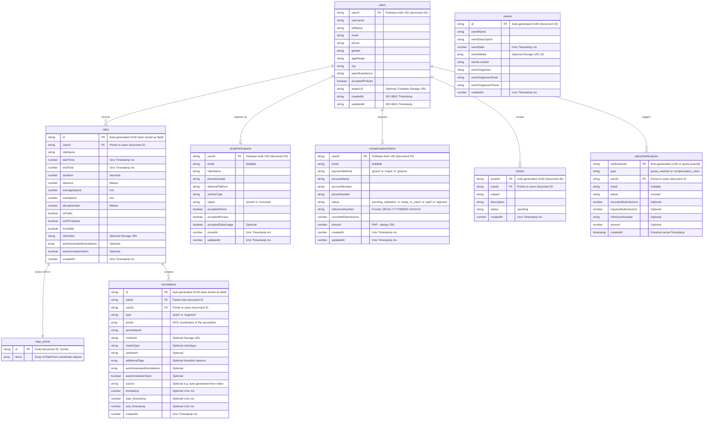

# Database Design & Schema Architecture

**Project Name:** Devia  
**Database Type:** Google Cloud Firestore (NoSQL Document Store)  
**Storage Type:** Google Cloud Storage (Firebase Storage)

---

## 1. Architectural Overview

Devia uses **Google Cloud Firestore**, a NoSQL document-oriented database, for high scalability, offline synchronization support, and real-time updates.

Unlike relational databases (SQL), Firestore uses a hierarchical structure consisting of **Collections**, **Documents**, and **Subcollections**. In our design:
* **Collections** (e.g., `users`, `rides`, `events`) contain independent documents.
* **Subcollections** (e.g., `rides/{rideId}/annotations`, `rides/{rideId}/map`) allow nested relationships.
* **Reference IDs** are used to create logical links (foreign keys) between collections.

### Smart Design Detail: Handling GPS Logs
Firestore documents have a maximum size limit of **1MB**. A GPS log for a long delivery ride can easily contain thousands of coordinates, which could cause a single document to exceed this limit.
* **Our Solution:** We isolate the detailed GPS coordinate array (`items: RidePoint[]`) in a fixed subcollection document at `/rides/{rideId}/map/points`. This keeps the main `/rides/{rideId}` document lightweight, cheap to list-query, and safe from document size limits.

---

## 2. Entity-Relationship Diagram (ERD)

Although Firestore is NoSQL, the logical relationships between data models can be visualized using a relational ERD.



---

## 3. Data Dictionary (Schema Specifications)

### 3.1. Collection: `users`
* **Path:** `/users/{userId}`
* **Document ID:** Firebase Auth UID. The document ID acts as the primary key; a separate `id` field is **not** stored in the Firestore document itself.
* **Purpose:** Stores profile details and onboarding survey information of the rider.

| Field Name | Data Type | Required | Description / Constraints |
| :--- | :--- | :--- | :--- |
| `username` | String | Yes | Rider display name (same as `fullName` on onboarding) |
| `fullName` | String | Yes | Full rider name from onboarding form |
| `email` | String | Yes | Firebase Auth email address |
| `phone` | String | Yes | Philippine mobile number, format: `09xxxxxxxxx` |
| `gender` | String | Yes | Gender identity selected during onboarding |
| `ageRange` | String | Yes | Age range category (e.g., "18-24", "25-34") |
| `city` | String | Yes | Municipality/City where the rider delivers |
| `yearsExperience` | String | Yes | Experience range (e.g., "<1 year", "1-2 years") |
| `acceptedPolicies` | Boolean | Yes | Must be `true`; agreed to Terms & Privacy |
| `avatarUrl` | String | No | Firebase Storage download URL for profile photo |
| `createdAt` | String | Yes | ISO 8601 string timestamp of account creation |
| `updatedAt` | String | Yes | ISO 8601 string timestamp of last profile update |

---

### 3.2. Collection: `rides`
* **Path:** `/rides/{rideId}`
* **Document ID:** Auto-generated UUID. The `id` field is also written into the document body (see `saveRide` in `rides.ts`).
* **Purpose:** Stores summary stats of a completed delivery trip.

| Field Name | Data Type | Required | Description / Constraints |
| :--- | :--- | :--- | :--- |
| `id` | String | Yes | Same as the document ID |
| `userId` | String | Yes | Foreign key — the Firebase Auth UID of the rider |
| `rideName` | String | Yes | Name given to the trip |
| `startTime` | Number | Yes | Unix timestamp (ms) when the ride started |
| `endTime` | Number | Yes | Unix timestamp (ms) when the ride ended |
| `duration` | Number | Yes | Total ride time in seconds |
| `distance` | Number | Yes | Total distance traveled in meters |
| `averageSpeed` | Number | Yes | Average speed in m/s |
| `maxSpeed` | Number | Yes | Peak speed in m/s |
| `elevationGain` | Number | Yes | Total elevation gain in meters |
| `isPublic` | Boolean | Yes | When `true`, visible in the community feed |
| `isGPXUpload` | Boolean | Yes | `true` if imported from a GPX file |
| `fromWeb` | Boolean | Yes | `true` if created from the web client |
| `rideVideo` | String | No | Firebase Storage URL for a recorded dashcam video |
| `autoGeneratedAnnotations` | Array | No | Auto-detected deviation segments from video analysis |
| `autoAnnotationSeen` | Boolean | No | `true` once the rider has reviewed auto-suggestions |
| `createdAt` | Number | Yes | Unix timestamp (ms) of when the DB record was saved |

---

### 3.3. Subcollection: `map` → Document: `points` (Under `rides`)
* **Path:** `/rides/{rideId}/map/points`
* **Document ID:** Static, always `"points"`.
* **Purpose:** Stores the full GPS breadcrumb trail separately from the summary document to stay within Firestore's 1 MB document size limit.

| Field Name | Data Type | Required | Description / Constraints |
| :--- | :--- | :--- | :--- |
| `items` | Array (Object) | Yes | Ordered list of `RidePoint` coordinate objects |

#### `RidePoint` Object Shape
```json
{
  "coordinate": {
    "latitude": 14.598720,
    "longitude": 120.984222
  },
  "timestamp": 1720345678000,
  "elevation": 45.2
}
```

---

### 3.4. Subcollection: `annotations` (Under `rides`)
* **Path:** `/rides/{rideId}/annotations/{annotationId}`
* **Document ID:** Auto-generated UUID. The `id` field is also written into the document body.
* **Purpose:** Stores each deviation/event marker the rider tagged during or after the trip.

| Field Name | Data Type | Required | Description / Constraints |
| :--- | :--- | :--- | :--- |
| `id` | String | Yes | Same as the document ID |
| `rideId` | String | Yes | Parent ride document ID |
| `userId` | String | Yes | Firebase Auth UID of the rider who created it |
| `annotationId` | String | Yes | Marker/local layout reference ID |
| `type` | String | Yes | `'point'` (single location) or `'segment'` (range) |
| `points` | Array (Object) | Yes | GPS coordinates of the annotated spot/segment |
| `mediaUri` | String | No | Firebase Storage URL for photo or audio note |
| `mediaType` | String | No | Mimetype string (e.g., `image/jpeg`, `audio/m4a`) |
| `sentiment` | String | No | Sentiment analysis output from audio/text |
| `additionalTags` | Array (String) | No | Checklist reasons rider selected (e.g., `["Traffic"]`) |
| `autoGeneratedAnnotations` | Array | No | AI-suggested deviation data linked to this annotation |
| `autoAnnotationSeen` | Boolean | No | Whether the rider acknowledged the auto-suggestion |
| `source` | String | No | `"auto-generated-from-video"` when created by AI |
| `timestamp` | Number | No | Video/ride time offset in ms for point annotations |
| `start_timestamp` | Number | No | Start of deviation range in ms for segment annotations |
| `end_timestamp` | Number | No | End of deviation range in ms for segment annotations |
| `createdAt` | Number | Yes | Unix timestamp (ms) of record creation |

---

### 3.5. Collection: `studyParticipants`
* **Path:** `/studyParticipants/{userId}`
* **Document ID:** Firebase Auth UID (same as the `users` document ID).
* **Purpose:** Tracks which riders have consented to and enrolled in the research study.

| Field Name | Data Type | Required | Description / Constraints |
| :--- | :--- | :--- | :--- |
| `userId` | String | Yes | Firebase Auth UID, mirrors the document ID |
| `email` | String/null | Yes | Firebase Auth email; can be `null` |
| `riderName` | String | Yes | Full name for the study record |
| `phoneNumber` | String | Yes | Normalized Philippine mobile number (`09xxxxxxxxx`) |
| `deliveryPlatform` | String | Yes | Platform name (e.g., Grab, Foodpanda, Lalamove) |
| `vehicleType` | String | Yes | Vehicle used (e.g., Motorcycle, Bicycle, Car) |
| `status` | String | Yes | `'joined'` or `'removed'` |
| `acceptedTerms` | Boolean | Yes | Must be `true` |
| `acceptedPrivacy` | Boolean | Yes | Must be `true` |
| `acceptedDataUsage` | Boolean | No | Set during onboarding enrollment flow |
| `joinedAt` | Number | Yes | Unix timestamp (ms) of enrollment |
| `updatedAt` | Number | Yes | Unix timestamp (ms) of last modification |

---

### 3.6. Collection: `compensationClaims`
* **Path:** `/compensationClaims/{userId}`
* **Document ID:** Firebase Auth UID.
* **Purpose:** Manages ₱250 compensation claims submitted after reaching 10 qualifying ride submissions.

| Field Name | Data Type | Required | Description / Constraints |
| :--- | :--- | :--- | :--- |
| `userId` | String | Yes | Firebase Auth UID, mirrors the document ID |
| `email` | String/null | Yes | Firebase Auth email; can be `null` |
| `paymentMethod` | String | Yes | `'gcash'`, `'maya'`, or `'gotyme'` |
| `accountName` | String | Yes | Registered name of e-wallet account |
| `accountNumber` | String | Yes | E-wallet account number |
| `phoneNumber` | String | Yes | Normalized mobile number linked to the e-wallet |
| `status` | String | Yes | `'pending_validation'`, `'ready_to_claim'`, `'paid'`, or `'rejected'` |
| `referenceNumber` | String | Yes | Auto-generated format: `DEVIA-YYYYMMDD-XXXXXX` |
| `recordedSubmissions` | Number | Yes | Verified ride count at the time of claim (minimum: 10) |
| `amount` | Number | Yes | Fixed at `250` (Philippine Peso) |
| `createdAt` | Number | Yes | Unix timestamp (ms) when the claim was submitted |
| `updatedAt` | Number | Yes | Unix timestamp (ms) of last status change |

---

### 3.7. Collection: `tickets`
* **Path:** `/tickets/{ticketId}`
* **Document ID:** Auto-generated UUID.
* **Purpose:** Stores helpdesk/support requests submitted by riders from the in-app support screen.
* **Note:** The document ID is not saved as a field inside the document body.

| Field Name | Data Type | Required | Description / Constraints |
| :--- | :--- | :--- | :--- |
| `userId` | String | Yes | Firebase Auth UID of the submitter |
| `subject` | String | Yes | Brief summary of the support issue |
| `description` | String | Yes | Full description of the problem |
| `status` | String | Yes | Always `'pending'` on creation; updated by admin |
| `createdAt` | Number | Yes | Unix timestamp (ms) of submission |

---

### 3.8. Collection: `events`
* **Path:** `/events/{eventId}`
* **Document ID:** Auto-generated UUID (document ID not stored as field in reads, but injected as `id` in app-side code).
* **Purpose:** Community events/announcements pushed by admins and shown on the app dashboard.
* **Access:** Read-only for authenticated riders; write is blocked by Firestore rules (admin-only via Firebase console or backend).

| Field Name | Data Type | Required | Description / Constraints |
| :--- | :--- | :--- | :--- |
| `eventName` | String | Yes | Title of the event |
| `eventDescription` | String | Yes | Full body text of the announcement |
| `eventDate` | Number | Yes | Date of the physical event (Unix ms) |
| `eventLocation` | String | Yes | Venue or location description |
| `eventOrganizer` | String | Yes | Name of organizing group or person |
| `eventOrganizerEmail` | String | Yes | Organizer contact email |
| `eventOrganizerPhone` | String | Yes | Organizer contact phone |
| `eventMedia` | Array (String) | No | Firebase Storage URLs for image attachments |
| `createdAt` | Number | Yes | Unix timestamp (ms) of publication |

---

### 3.9. Collection: `adminNotifications`
* **Path:** `/adminNotifications/{notificationId}`
* **Document ID:** Either auto-generated UUID (for compensation claim alerts) or a fixed key `quota-{userId}` (for quota-reached alerts, to prevent duplicates).
* **Purpose:** Internal notification feed for the research team. Created automatically by the app when a rider hits 10 rides or submits a compensation claim. Only admins can read this collection (Firestore rules block all user reads).

| Field Name | Data Type | Required | Description / Constraints |
| :--- | :--- | :--- | :--- |
| `type` | String | Yes | `'quota_reached_ready_for_cross_check'` or `'compensation_claim_ready_for_validation'` |
| `userId` | String | Yes | Firebase Auth UID of the triggering rider |
| `email` | String/null | Yes | Rider email for admin reference |
| `status` | String | Yes | Always `'unread'` on creation |
| `recordedSubmissions` | Number | No | Ride count at trigger time (for quota alerts) |
| `requiredSubmissions` | Number | No | Threshold value `10` (for quota alerts) |
| `referenceNumber` | String | No | Claim reference number (for compensation alerts) |
| `amount` | Number | No | Claim amount in PHP (for compensation alerts) |
| `createdAt` | Timestamp | Yes | Firestore `serverTimestamp()` — NOT a Unix number |

---

## 4. Storage Architecture (Firebase Cloud Storage)

Media files are stored in Firebase Storage using the following folder conventions:

| Storage Path | Associated With | Contents |
| :--- | :--- | :--- |
| `profile-images/{uid}` | `users` | Rider profile photo |
| `rides/{rideId}/annotations/{annotationId}` | `annotations` | Photo or audio note attached to a deviation |

> **Note:** A `rides/{rideId}/videos/` path is referenced in code comments but is not yet formally implemented. The `rideVideo` field on a `rides` document stores the URL when used.

---

## 5. Security Rules Summary (`firestore.rules`)

Rules are defined in [firestore.rules](../firestore.rules) and follow the principle of least privilege:

| Collection | Read Rule | Write Rule |
| :--- | :--- | :--- |
| `users/{userId}` | Owner only (`auth.uid == userId`) | Owner only |
| `rides/{rideId}` | Owner only (`resource.data.userId == auth.uid`) | Create: authenticated + userId matches; Update/Delete: owner only |
| `rides/{rideId}/annotations` | Owner only (via ride parent ownership check) | Owner only |
| `studyParticipants/{userId}` | Owner only | Owner only |
| `compensationClaims/{userId}` | Owner only | Owner only |
| `tickets/{ticketId}` | Owner only (`resource.data.userId == auth.uid`) | Authenticated users |
| `adminNotifications/{id}` | **Nobody** (`allow read: if false`) | Authenticated users (app writes only) |
| `events/{eventId}` | Any authenticated user | **Nobody** (`allow write: if false`) |
| `app_version/{docId}` | **Everyone** (public, unauthenticated) | **Nobody** |

> **Key note:** The `isPublic` field on rides controls app-layer community feed visibility, but the **Firestore security rule** itself still restricts reads to the ride owner. Public feed queries would need to be handled via a Firebase Admin SDK backend (e.g., Cloud Functions) if strict rule enforcement is required.
