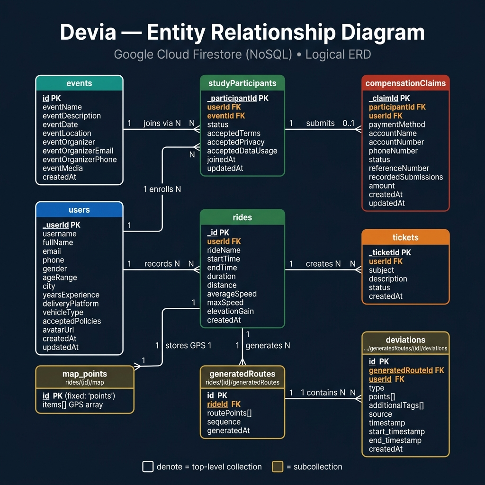
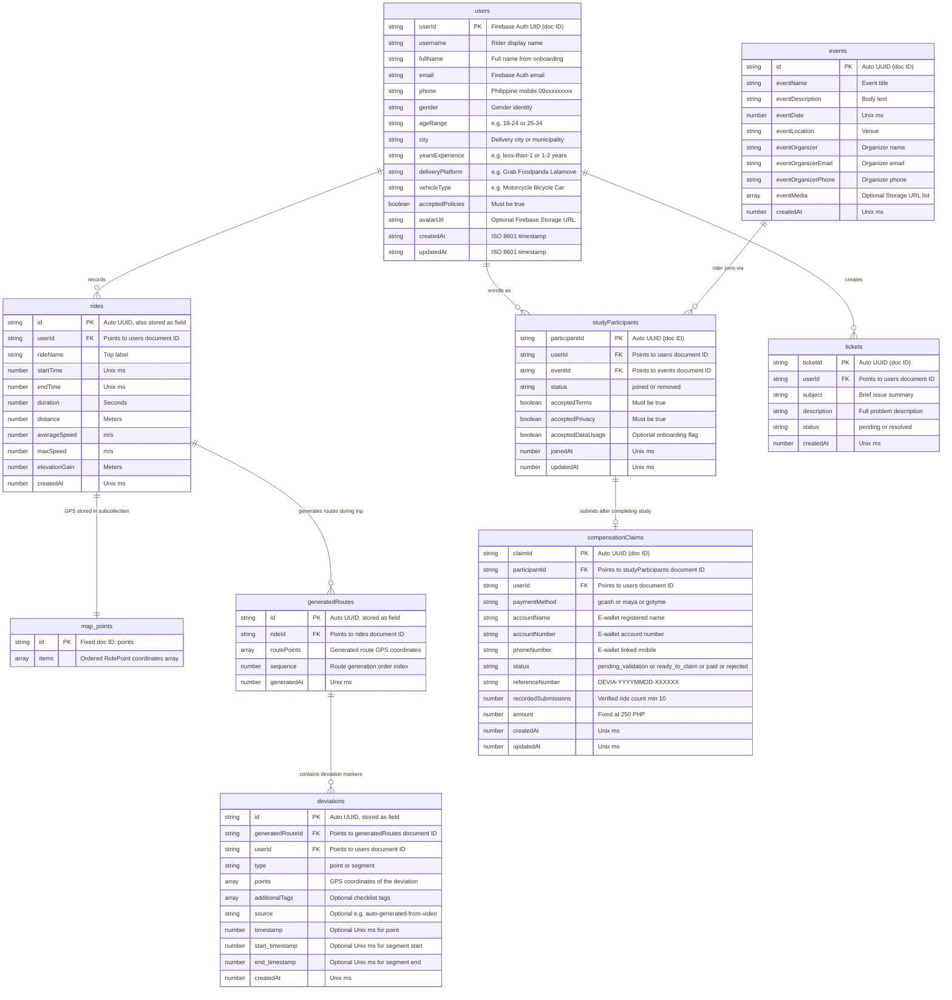

# Entity-Relationship Diagram — Devia

**Project Name:** Devia — Last-Mile Delivery Route Research App  
**Database:** Google Cloud Firestore (NoSQL Document Store)  
**Storage:** Google Cloud Firebase Storage  
**Version:** 1.0  

---

## 1. Conceptual Overview

Devia uses **Google Cloud Firestore**, a NoSQL document-oriented database. Unlike relational databases, Firestore organizes data in a **Collection → Document → Subcollection** hierarchy.

| Relational Concept | Firestore Equivalent |
|:---|:---|
| Table | Collection |
| Row | Document |
| Column | Field |
| Primary Key | Document ID (auto-UUID or Firebase Auth UID) |
| Foreign Key | Reference ID field (string pointing to another document) |
| Nested Table | Subcollection |
| Enum / Lookup | Constrained string field |

---

## 2. Entity-Relationship Diagram



> **Mermaid source** (renders on GitHub):



---

## 3. Firestore Collection Hierarchy

```
Firestore Root
│
├── users/
│   └── {userId}                             ← Firebase Auth UID as doc ID
│
├── rides/
│   └── {rideId}                             ← Auto UUID
│       ├── map/                             ← Subcollection
│       │   └── points                       ← Fixed doc ID: GPS breadcrumb trail
│       └── generatedRoutes/                 ← Subcollection
│           └── {routeId}                    ← Auto UUID: one per generated route
│               └── deviations/              ← Sub-subcollection
│                   └── {deviationId}        ← Auto UUID: deviation markers
│
├── studyParticipants/
│   └── {userId}                             ← Firebase Auth UID as doc ID
│
├── compensationClaims/
│   └── {userId}                             ← Firebase Auth UID as doc ID
│
├── tickets/
│   └── {ticketId}                           ← Auto UUID
│
├── events/
│   └── {eventId}                            ← Auto UUID
│
└── app_version/
    └── {docId}                              ← Version metadata (public read)
```

---

## 4. Firebase Storage Paths

| Storage Path | Linked Collection / Document | Contents |
|:---|:---|:---|
| `profile-images/{uid}` | `users/{uid}` → `avatarUrl` | Rider profile photo |
| `rides/{rideId}/annotations/{annotationId}` | `rides/{rideId}/annotations/{annotationId}` → `mediaUri` | Photo or audio deviation note |
| `rides/{rideId}/videos/` | `rides/{rideId}` → `rideVideo` | Dashcam video (not yet formally implemented) |

---

## 5. System Data Flow

```
┌────────────────────────────────────────┐
│         Rider (Mobile App)             │
│   React Native + Expo (iOS / Android)  │
│                                        │
│  • Register / Login (phone number)     │
│  • Record GPS delivery ride            │
│  • Tag deviation annotations           │
│  • Upload dashcam video                │
│  • Join research study                 │
│  • Submit ₱250 compensation claim      │
└──────────────────┬─────────────────────┘
                   │
          Firebase Client SDK
          (SDK rules enforced)
                   │
                   ▼
┌────────────────────────────────────────┐
│            Google Firebase             │
│                                        │
│  ┌──────────────┐  ┌────────────────┐  │
│  │ Firebase     │  │ Firebase       │  │
│  │ Auth         │  │ Storage        │  │
│  └──────┬───────┘  └───────┬────────┘  │
│         │ UID              │ URLs      │
│  ┌──────▼───────────────────▼───────┐  │
│  │        Cloud Firestore           │  │
│  │   (security rules enforced)      │  │
│  └──────────────────────────────────┘  │
└────────────────────┬───────────────────┘
                     │
          Firebase Admin SDK
          (server-side, rules bypassed)
                     │
                     ▼
┌────────────────────────────────────────┐
│       Admin Web Dashboard              │
│  Next.js 14 (App Router) — same repo  │
│                                        │
│  • View all users & rides              │
│  • Manage study participants           │
│  • Process compensation claims         │
│  • Resolve support tickets             │
│  • Publish / edit community events     │
│  • Monitor admin notifications         │
└──────────────────┬─────────────────────┘
                   │
                   ▼
┌────────────────────────────────────────┐
│       Research Team / Admin            │
└────────────────────────────────────────┘
```

---

## 6. Security Model Summary

| Collection | Mobile App Access | Admin Web Access |
|:---|:---|:---|
| `users/{userId}` | Owner read/write only | Full read/write (Admin SDK) |
| `rides/{rideId}` | Owner read/write only | Full read/write (Admin SDK) |
| `rides/{rideId}/map/points` | Owner only | Full access (Admin SDK) |
| `rides/{rideId}/generatedRoutes` | Owner only | Full access (Admin SDK) |
| `rides/{rideId}/generatedRoutes/{routeId}/deviations` | Owner only | Full access (Admin SDK) |
| `studyParticipants/{userId}` | Owner read/write only | Full read/write (Admin SDK) |
| `compensationClaims/{userId}` | Owner read/write only | Full read/write + status updates |
| `tickets/{ticketId}` | Owner read; any auth write | Full read/write; mark resolved |
| `events/{eventId}` | Read only (authenticated) | Full CRUD via Admin SDK |
| `app_version/{docId}` | Public read | Full write via Admin SDK |

---

## 7. Relationship Table

| From | To | Cardinality | Description |
|:---|:---|:---|:---|
| `users` | `rides` | One-to-Many | A rider records many delivery trips |
| `users` | `studyParticipants` | One-to-Many | A rider can enroll in multiple study events over time |
| `users` | `tickets` | One-to-Many | A rider creates multiple support tickets |
| `events` | `studyParticipants` | One-to-Many | A rider joins the study by enrolling through an event |
| `studyParticipants` | `compensationClaims` | One-to-One (optional) | Each study participation can produce at most one compensation claim |
| `rides` | `map/points` | One-to-One | Each ride has exactly one GPS breadcrumb document |
| `rides` | `generatedRoutes` | One-to-Many | A ride generates multiple routes as deviations occur during the trip |
| `generatedRoutes` | `deviations` | One-to-Many | Each generated route can have many deviation markers tagged by the rider |
