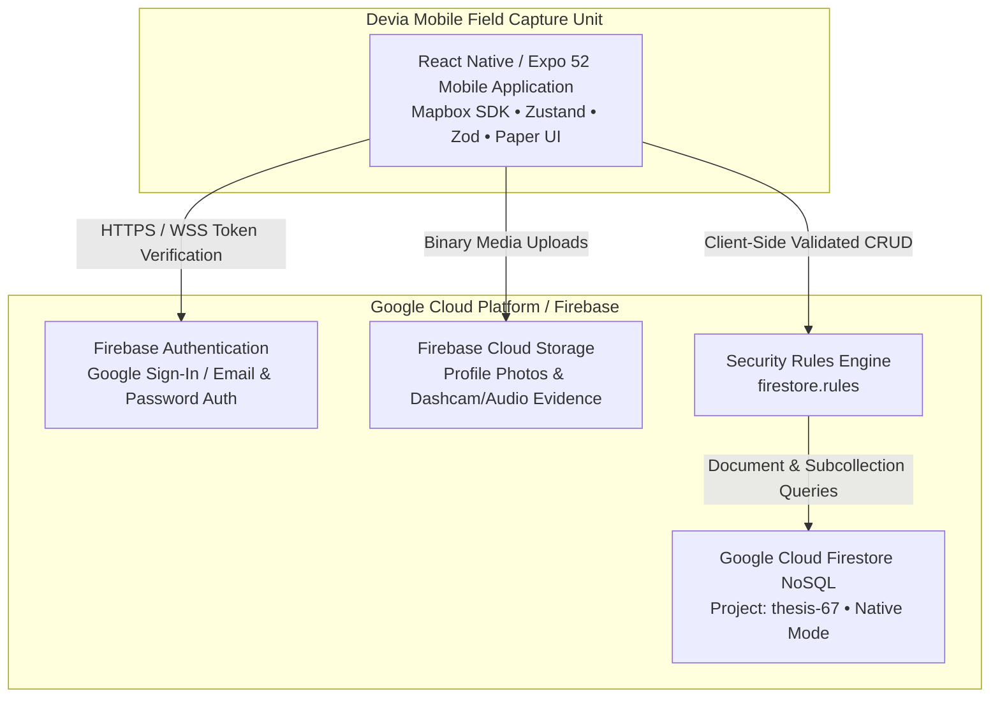
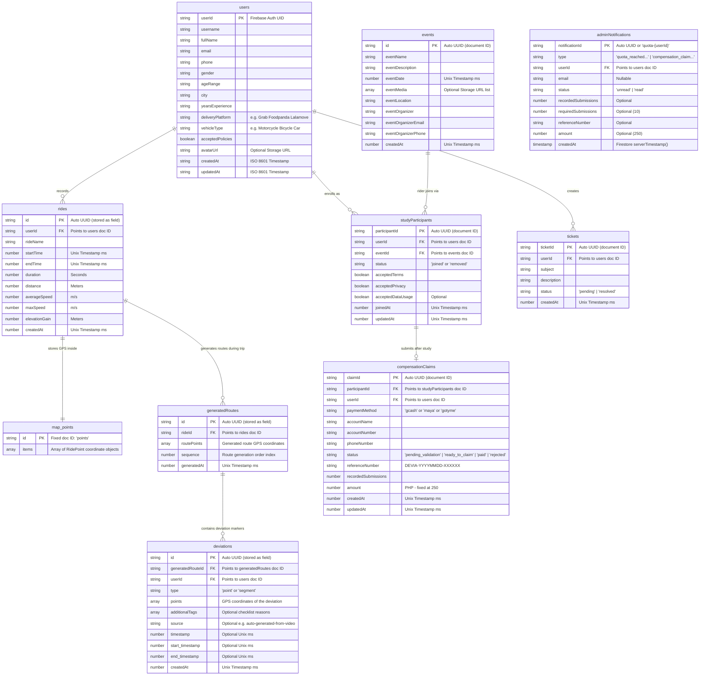

# DEVIA — LAST-MILE DELIVERY ROUTE DEVIATION RESEARCH MOBILE APPLICATION
## Full System & Technical Specifications Document

**Document Version:** 1.1.0  
**Target Audience:** Academic Thesis Adviser, Research Panel, Systems & Mobile Engineers  
**Project Classification:** Academic Research & Mobile Telemetry Capture Application  
**Target Deployment Environment:** Google Cloud Platform (`thesis-67`) / Android & iOS Mobile Devices  

---

## 1. Executive Summary & System Objectives

**Devia** is a specialized cross-platform mobile application (`React Native / Expo`) coupled with a cloud-native NoSQL persistence layer (`Google Cloud Firestore`), designed specifically to capture, quantify, and analyze the empirical drivers behind route deviations among last-mile delivery couriers (e.g., Grab, Foodpanda, and Lalamove riders in the Philippines).

While commercial routing algorithms calculate minimum-time or shortest-distance paths, delivery couriers routinely deviate due to unmapped localized constraints (e.g., severe traffic bottlenecks, roadwork, flood-prone alleys, customer-directed shortcuts, or safety considerations). Devia bridges this gap by recording high-frequency GPS telemetry alongside structured, qualitative rider annotations right from their mobile devices, providing academic researchers with high-fidelity datasets to train urban logistics models and graph neural networks (e.g., Graph Attention Networks).

### 1.1 Core Application Capabilities
1. **High-Precision GPS Telemetry & Breadcrumb Capture:** Foreground and background mobile location tracking with decoupled subcollection storage (`/map/points`) to bypass NoSQL document size ceilings.
2. **Hierarchical Route Deviation Tagging:** Multi-tiered capture of dynamic route recalculations (`generatedRoutes`) and point/segment deviation markers (`deviations`) tagged with qualitative reasons and media evidence.
3. **Structured Study Enrollment & Quota Verification:** Complete mobile onboarding consent tracking (Terms, Privacy, Data Usage) linked to a verifiable 10-ride verification threshold.
4. **E-Wallet Compensation Claim Workflow:** Automated verification progress and payout request tracking (`DEVIA-YYYYMMDD-XXXXXX`) across major Philippine financial platforms (GCash, Maya, GoTyme).
5. **In-App Helpdesk & Community Events Feed:** Built-in customer support ticketing (`tickets`) and real-time viewing of study announcements and community meetups (`events`).

---

## 2. System Architecture & Technology Stack

The Devia mobile ecosystem is built on a decoupled, cloud-native architecture directly connecting native field capture devices (`iOS` and `Android`) to Google Cloud Platform (`thesis-67`) via secure, rule-governed Firebase APIs.



### 2.1 Technology Stack Matrix

| Architectural Layer | Technology / Component | Version / Spec | Primary Role & Rationale |
| :--- | :--- | :--- | :--- |
| **Mobile Runtime** | React Native / Expo | v0.76.9 / Expo v52 | Cross-platform native compilation providing deep OS-level GPS and sensor access. |
| **Language** | TypeScript | v5.8.x | Strict compile-time type enforcement across telemetry and state payloads. |
| **Mapping Engine** | `@rnmapbox/maps` | v10.1.x | High-performance OpenGL/Metal interactive vector map rendering and route visualization. |
| **Telemetry Capture** | `expo-location` | v18.0.x | Foreground and background GPS coordinate tracking with custom distance/time filters. |
| **State Management** | Zustand | v5.0.x | Lightweight, boilerplate-free global state store for active trip recording and user profiles. |
| **Form & Validation** | React Hook Form + Zod | v7.56.x / v3.25.x | High-performance form state handling coupled with strict runtime schema verification. |
| **Mobile UI System** | React Native Paper | v5.14.x | Material Design components optimized for outdoor legibility and touch ergonomics. |
| **Database Engine** | Google Cloud Firestore | NoSQL Document Store | Real-time synchronization, offline persistence/caching, and horizontal scalability. |
| **Cloud Storage** | Firebase Cloud Storage | Bucket: `thesis-67` | Secure object storage for rider profile photographs and deviation audio/visual attachments. |
| **Containerization** | Docker Engine | `node:20-bullseye-slim` | Reproducible CI/CD container pre-built with Java 17 JDK and Android SDK 34 for native APK compilation. |

---

## 3. Detailed Functional Specifications

### 3.1 Mobile Application Modules (`app/`, `components/`, `lib/`)

#### 3.1.1 Authentication & Onboarding Engine
* **Authentication Protocols:** Supports seamless Google Sign-In (`@react-native-google-signin/google-signin`) and standard Email/Password authentication via Firebase Auth (`@react-native-firebase/auth`).
* **Demographic & Professional Capture:** Mandates structured onboarding upon initial registration before unlocking telemetry capture features:
  * Full Name & Display Username.
  * Normalized Philippine Mobile Number (`09xxxxxxxxx`).
  * Demographic Categorization (`gender`, `ageRange`, `city`).
  * Professional Background (`yearsExperience`).
  * Primary Delivery Platform (`Grab`, `Foodpanda`, `Lalamove`).
  * Vehicle Classification (`Motorcycle`, `Bicycle`, `Car`).
* **Institutional Consent Enforcement:** Requires explicit, boolean-enforced agreement to academic research protocols (`acceptedPolicies`, `acceptedTerms`, `acceptedPrivacy`) with optional data usage tracking consent (`acceptedDataUsage`).

#### 3.1.2 GPS Telemetry & Route Recording Module (`rides/` Collection)
* **High-Frequency Location Tracking:** Captures continuous latitude, longitude, timestamp (ms), speed (m/s), and elevation (m) coordinates using native OS foreground and background location services (`FOREGROUND_SERVICE_LOCATION`).
* **Telemetry Summary Aggregation:** Automatically calculates and writes summary metrics to the parent `rides/{rideId}` document upon completion of a delivery trip:
  * Total trip duration (seconds) and cumulative distance (meters).
  * Average velocity (`averageSpeed` in m/s) and maximum velocity (`maxSpeed` in m/s).
  * Cumulative vertical ascent (`elevationGain` in meters).
* **Document Size Decoupling (Structural Optimization):** To ensure compliance with Firestore's strict **1 MB document size ceiling**, the high-density array of raw GPS coordinates (`items: RidePoint[]`) is decoupled and saved into a dedicated subcollection document: `/rides/{rideId}/map/points`.

#### 3.1.3 Route Deviation & Annotation System (`generatedRoutes/` & `deviations/`)
* **Dynamic Route Generation Tracking:** When a rider alters their path relative to the baseline navigation route during a delivery, the app logs each distinct navigation recalculation as an ordered record in `/rides/{rideId}/generatedRoutes/{routeId}`, tracking sequence order via `sequence: number`.
* **Qualitative Deviation Tagging (`deviations` Sub-subcollection):** Riders tag specific route alterations directly against the active generated route (`/rides/{rideId}/generatedRoutes/{routeId}/deviations/{deviationId}`):
  * **Deviation Type:** Categorized as either `'point'` (single intersection/location spot) or `'segment'` (continuous stretch of road).
  * **Qualitative Checklist Tags (`additionalTags`):** Pre-classified reasons selected by the courier (e.g., *Heavy Traffic*, *Road Construction*, *Flooding/Impassable*, *Shortcut/Familiar Route*, *Customer Request*).
  * **Evidence Capture (`mediaUri`, `mediaType`):** Optional attachment of dashcam/phone photos (`image/jpeg`) or voice memos (`audio/m4a`).
  * **Temporal Synchronization:** Stores precise time offsets (`timestamp` for points; `start_timestamp`/`end_timestamp` for segments) to correlate with recorded trip video/telemetry (`source: "auto-generated-from-video"`).

#### 3.1.4 Study Participation & Verification Quota Tracking (`studyParticipants/`)
* **Event-Linked Study Roster:** Riders enroll in specific data collection phases by linking their mobile account to an active research event (`eventId` FK pointing to `events/{eventId}`).
* **Multiple Participation Model:** Uses a unique surrogate primary key (`participantId`) rather than the user's UID. This architectural choice allows a rider to enroll in multiple distinct study phases over time without overwriting prior longitudinal records.
* **Verification Progress Bar:** The mobile dashboard provides real-time visual tracking of verified ride submissions (`recordedSubmissions`) against the academic requirement of **10 qualifying delivery trips**.

#### 3.1.5 E-Wallet Compensation Claim Workflow (`compensationClaims/`)
* **Quota Unlock Trigger:** Upon achieving 10 verified delivery trips across their active study participation record, the application automatically unlocks the compensation claim submission screen.
* **Financial Data Capture:** Collects verified payout details directly from the rider:
  * Payment Method (`'gcash'`, `'maya'`, or `'gotyme'`).
  * E-Wallet Registered Name (`accountName`) and Account Number (`accountNumber`).
  * Linked Mobile Number (`phoneNumber`).
* **Reference Number Generation:** Automatically assigns a tamper-proof, standardized tracking identifier formatted as `DEVIA-YYYYMMDD-XXXXXX` (e.g., `DEVIA-20260713-8A3F12`).
* **Status Lifecycle Tracking:** Claims enter the database under `'pending_validation'`, and the mobile UI dynamically reflects progress as the status updates to `'ready_to_claim'`, `'paid'`, or `'rejected'`.
* **Multi-Claim Capability:** Uses a unique `claimId` PK with foreign key pointers to `participantId` and `userId`, enabling couriers to submit consecutive claims across distinct study enrollment periods.

#### 3.1.6 Support Helpdesk & Community Events Feed (`tickets/` & `events/`)
* **In-App Customer Support (`tickets`):** Riders can submit structured helpdesk tickets (`subject`, `description`) directly from their device. Tickets are initialized with `'pending'` status.
* **Community Events Feed (`events`):** Displays research announcements, safety webinars, and data collection meetups (`eventName`, `eventDate`, `eventLocation`, `eventMedia`) pushed from the cloud.
* **Automated Admin Notification Trigger (`adminNotifications`):** When a rider successfully completes their 10-ride quota or submits a new compensation claim, the mobile application automatically writes a system alert document to `adminNotifications/{notificationId}` to notify the backend research team.

---

## 4. Data Dictionary & Relational Schema (`Firestore`)

### 4.1 Top-Level Collections & Subcollections



---

## 5. Security Rules & Access Control Architecture (`firestore.rules`)

The mobile application follows the **Principle of Least Privilege**. Direct client-side queries and mutations from mobile devices are governed strictly by server-enforced `firestore.rules`, preventing unauthorized data access or modification across different couriers.

### 5.1 Security Rule Enforcement Summary

| Collection Path | Read Access Rule | Write Access Rule | Rationale |
| :--- | :--- | :--- | :--- |
| `users/{userId}` | `auth.uid == userId` | `auth.uid == userId` | Strict isolation of rider demographic & contact records. |
| `rides/{rideId}` | `resource.data.userId == auth.uid` | Create: `request.resource.data.userId == auth.uid`<br/>Update/Delete: `resource.data.userId == auth.uid` | Riders only access and modify their own delivery trip histories. |
| `rides/{rideId}/map/points` | Inherits parent ride ownership | Inherits parent ride ownership | Protects high-density GPS coordinates from unauthorized querying. |
| `rides/{rideId}/generatedRoutes/{id}` | Inherits parent ride ownership | Inherits parent ride ownership | Locks generated route sequences to the trip owner. |
| `.../deviations/{deviationId}` | Inherits parent ride ownership | Inherits parent ride ownership | Isolates qualitative deviation tags and media references. |
| `studyParticipants/{participantId}`| `resource.data.userId == auth.uid` | `request.auth != null` | Authenticated users can enroll; can only read own enrollments. |
| `compensationClaims/{claimId}` | `resource.data.userId == auth.uid` | `resource.data.userId == auth.uid` | Isolates sensitive e-wallet banking and payout records. |
| `tickets/{ticketId}` | `resource.data.userId == auth.uid` | `request.auth != null` | Riders submit helpdesk tickets securely. |
| `adminNotifications/{id}` | **Nobody** (`allow read: if false`) | `request.auth != null` | Client app writes alerts on quota/claim trigger; client reading is blocked. |
| `events/{eventId}` | `request.auth != null` | **Nobody** (`allow write: if false`) | Community announcements readable by all riders; writeable only by server/admin. |

---

## 6. Pre-Deployment & Server Verification Specifications

Prior to staging or production deployment of the mobile app and database to the cloud server, the following technical prerequisites and verification protocols must be executed by the deployment engineer:

### 6.1 Cloud Database & Storage Infrastructure Checklist
1. **Google Cloud Firestore (`thesis-67`) Configuration:**
   * Verify Firestore database instance is set to **Native Mode** in the primary deployment region (e.g., `asia-southeast1` for low-latency mobile access across the Philippines).
   * Deploy the finalized `firestore.rules` file to production:
     ```bash
     firebase deploy --only firestore:rules
     ```
   * Ensure composite indexes for high-frequency queries (`rides` by `userId` and `startTime DESC`; `deviations` by `userId` and `createdAt DESC`) are provisioned via `firestore.indexes.json`.

2. **Firebase Cloud Storage Configuration:**
   * Verify CORS configuration on the storage bucket (`gs://thesis-67.appspot.com`) allows binary media uploads (`image/jpeg`, `audio/m4a`) from mobile native clients.
   * Verify storage bucket access rules enforce user UID folder isolation (`profile-images/{uid}/*`).

### 6.2 Mobile Application Native Build & Distribution (`EAS`)
1. **App Manifest & Background Permissions Verification (`app.config.ts`):** Confirm native Android build manifests explicitly declare mandatory background geolocation permissions required for continuous delivery trip monitoring:
   * `ACCESS_COARSE_LOCATION`, `ACCESS_FINE_LOCATION`, `ACCESS_BACKGROUND_LOCATION`
   * `FOREGROUND_SERVICE`, `FOREGROUND_SERVICE_LOCATION`, `ACCESS_MEDIA_LOCATION`
2. **Production APK/IPA Generation via Expo Application Services (EAS):**
   ```bash
   # Generate production APK for rider distribution and device installation
   eas build --profile production --platform android
   ```
3. **Automated CI/CD Quality Assurance (`Dockerfile`):** Ensure the Dockerized verification pipeline (`Dockerfile` running `npm test` to execute **ESLint** and **TypeScript type checking** `tsc --noEmit`) passes with zero warnings across all mobile app packages (`app/`, `components/`, `lib/`) before tagging the production release APK.

---
**End of Devia Mobile Application Specifications Document**
