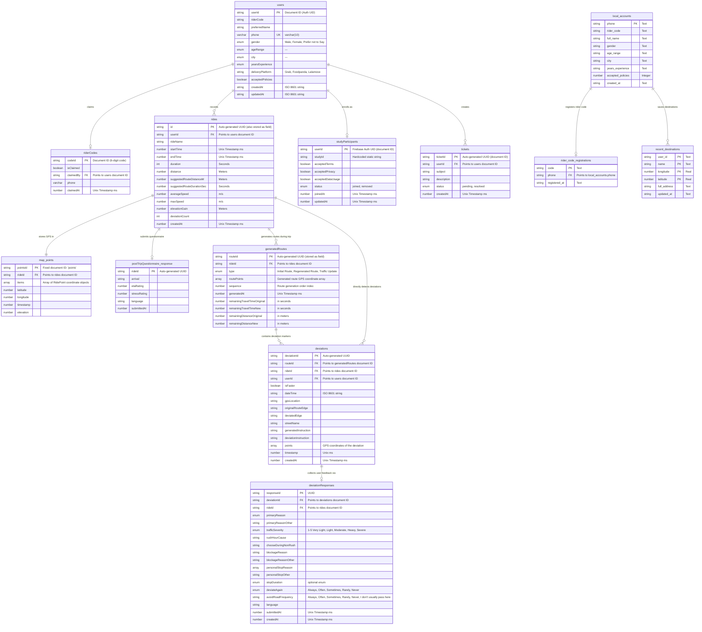

# Database Design & Schema Architecture

**Project Name:** Devia  
**Database Type:** Google Cloud Firestore (NoSQL Document Store)  
**Storage Type:** Google Cloud Storage (Firebase Storage)

---

## 1. Architectural Overview

Devia uses **Google Cloud Firestore**, a NoSQL document-oriented database, for high scalability, offline synchronization support, and real-time updates.

Unlike relational databases (SQL), Firestore uses a hierarchical structure consisting of **Collections**, **Documents**, and **Subcollections**. In our design:
* **Collections** (e.g., `users`, `rides`, `events`) contain independent documents.
* **Subcollections** (e.g., `rides/{rideId}/generatedRoutes`, `rides/{rideId}/map`) allow nested relationships.
* **Reference IDs** are used to create logical links (foreign keys) between collections.

### Smart Design Detail: Handling GPS Logs
Firestore documents have a maximum size limit of **1MB**. A GPS log for a long delivery ride can easily contain thousands of coordinates, which could cause a single document to exceed this limit.
* **Our Solution:** We isolate the detailed GPS coordinate array (`items: RidePoint[]`) in a fixed subcollection document at `/rides/{rideId}/map/points`. This keeps the main `/rides/{rideId}` document lightweight, cheap to list-query, and safe from document size limits.

---

## 2. Entity-Relationship Diagram (ERD) 
Last changed: 15/09/2026
Although Firestore is NoSQL, the logical relationships between data models can be visualized using a relational ERD.



---

## 3. Data Dictionary (Schema Specifications)

### 3.1. Collection: `users`
* **Path:** `/users/{userId}`
* **Document ID:** Firebase Auth UID. The document ID acts as the primary key; a separate `id` field is **not** stored in the Firestore document itself.
* **Purpose:** Stores profile details and onboarding survey information of the rider.

Last changed: 15/09/2026
| Field Name | Data Type | Required | Description / Constraints |
| :--- | :--- | :--- | :--- |
| `userId` | String | (Doc ID) | Firebase Auth UID. Not stored as field. |
| `riderCode` | String | Yes | Unique rider code assigned to the participant for the study |
| `preferredName` | String | Yes | Rider's preferred display name shown within the application |
| `phone` | Varchar | Yes | Philippine mobile number, format: `09xxxxxxxxx` |
| `gender` | Enum | Yes | Gender identity selected during onboarding |
| `ageRange` | Enum | Yes | Age range category (e.g., "18-24", "25-34") |
| `city` | Enum |  Yes | Municipality/City where the rider primarily performs deliveries |
| `yearsExperience` | Enum | Yes | Experience range (e.g., "<1 year", "1-2 years") |
| `deliveryPlatform` | String | Yes | Primary delivery platform used (e.g., Grab, Foodpanda, Lalamove) |
| `acceptedPolicies` | Boolean | Yes | Must be `true`; agreed to Terms of Service & Privacy Policy|
| `createdAt` | String | Yes | ISO 8601 string when the user account was created |
| `updatedAt` | String | Yes | ISO 8601 string when the profile was last updated |
---

### 3.2. Collection: `rides`
* **Path:** `/rides/{rideId}`
* **Document ID:** Auto-generated UUID. The `id` field is also written into the document body.
* **Purpose:** Stores summary stats of a completed delivery trip.

Last changed: 15/09/2026
| Field Name | Data Type | Required | Description / Constraints |
| :--- | :--- | :--- | :--- |
| `id` | String | Yes | Same as the document ID |
| `userId` | String | Yes | Foreign key — the Firebase Auth UID of the rider |
| `rideName` | String | Yes | Name given to the trip |
| `startTime` | Number | Yes | Unix timestamp (ms) when the ride started |
| `endTime` | Number | Yes | Unix timestamp (ms) when the ride ended |
| `duration` | Int | Yes | Total ride time in seconds |
| `distance` | Number | Yes | Total distance traveled in meters |
| `averageSpeed` | Number | Yes | Average speed in m/s |
| `maxSpeed` | Number | Yes | Peak speed in m/s |
| `elevationGain` | Number | Yes | Total elevation gain in meters |
| `suggestedRouteDistanceM` | Number | Yes | Suggested route distance in meters |
| `suggestedRouteDurationSec` | Number | Yes | Suggested route duration in seconds |
| `deviationCount` | Int | Yes | Total number of deviations detected during the ride |
| `createdAt` | Number | Yes | Unix timestamp (ms) of when the ride record was created |
---

### 3.3. Subcollection: `map` → Document: `points` (Under `rides`)
* **Path:** `/rides/{rideId}/map/points`
* **Document ID:** Static, always `"points"`.
* **Purpose:** Stores the full GPS breadcrumb trail separately from the summary document to stay within Firestore's 1 MB document size limit.
  
Last changed: 22/07/2026
| Field Name | Data Type | Required | Description / Constraints |
| :--- | :--- | :--- | :--- |
| `pointsId` | String | Yes | Static document ID |
| `rideId` | String | Yes | Parent ride document ID (foreign key referencing rides.rideId) |
| `items` | Array (Object) | Yes | Ordered list of `RidePoint` coordinate objects |

RidePoint Object
| Field Name | Data Type | Required | Description / Constraints |
| :--- | :--- | :--- | :--- |
| `coordinate.latitude` | Number | Yes | Latitude coordinate of the recorded GPS point |
| `coordinate.longitude` | Number | Yes | Longitude coordinate of the recorded GPS point |
| `timestamp` | Number | Yes | Unix timestamp (ms) when the GPS point was recorded |
| `elevation` | Number | Yes | Elevation (meters) at the recorded GPS point |

#### `RidePoint` Object Shape
```json
{
  "coordinate": {
    "latitude": 14.598720,
    "longitude": 120.984222
  },
  "timestamp": 1720345678000,
  "elevation": 45.2
}
```

---

### 3.4. Collection: `generatedRoutes`
* **Path:** `/generatedRoutes/{routeId}`
* **Document ID:** Auto-generated UUID. The `routeId` field is also written into the document body.
* **Purpose:** Stores each generated route during a trip. A new route is generated every time a rider deviates from the previous one — multiple generated routes are expected per trip (e.g., initial route → deviation → route 2 → deviation → route 3, and so on).

Last changed: 22/07/2026
| Field Name | Data Type | Required | Description / Constraints |
| :--- | :--- | :--- | :--- |
| `routeId` | String | Yes | Same as the document ID |
| `rideId` | String | Yes | Parent ride document ID (foreign key referencing rides.rideId) |
| `type` | Enum | Yes | Type of generated route (Initial Route or Regenerated Route) |
| `routePoints` | Array | Yes | Ordered list of RoutePoint objects representing the generated navigation route |
| `sequence` | Number| Yes | Route generation order index (1 = initial route, 2 = first regenerated route, etc.) |
| `generatedAt` | Number | Yes | Unix timestamp (ms) when the route was generated |
| `remainingTravelTimeOriginal` | Number | Yes | in seconds |
| `remainingTravelTimeNew` | Number | Yes | in seconds |
| `remainingDistanceOriginal` | Number | Yes | in meters |
| `remainingDistanceNew` | Number | Yes | in meters |
---

### 3.5. Collection: `deviations`
* **Path:** `/deviations/{deviationId}`
* **Document ID:** Auto-generated UUID. The `deviationId` field is also written into the document body.
* **Purpose:** Stores each deviation marker the rider tagged during or after the trip, linked to the specific generated route that was active when the deviation occurred.

Last changed: 30/07/2026
| Field Name | Data Type | Required | Description / Constraints |
| :--- | :--- | :--- | :--- |
| `deviationId` | String | Yes | Same as the document ID |
| `routeId` | String | Yes | Parent route document ID (foreign key referencing generatedRoutes.routeId) |
| `rideId` | String | Yes | Parent ride document ID (foreign key referencing rides.rideId) |
| `userId` | String | Yes | Foreign key referencing users.userId (Firebase Auth UID of the rider) |
| `isFaster` | Boolean | Yes | Indicates if the deviation resulted in a faster route |
| `dateTime` | String | Yes | ISO 8601 string indicating when the deviation occurred |
| `gpsLocation` | String | Yes | GPS coordinate where the rider first deviated from the generated route |
| `originalRouteEdge` | String | Yes | |
| `deviatedEdge` | String | Yes | |
| `streetName` | String | Yes | Name of the road where the deviation occurred |
| `generatedInstruction` | String | Yes | Navigation instruction generated by the routing engine immediately before the deviation occurred |
| `deviationInstruction` | String | Yes | Actual maneuver performed by the rider instead of the generated navigation instruction |
| `points` | Array | Yes | GPS coordinates representing the deviation location or segment |
| `timestamp` | Number | Yes | Unix ms |
| `createdAt` | Number | Yes | Unix Timestamp ms |
---

### 3.6. Collection: `deviationResponses`
* **Path:** `/deviationResponses/{responseId}`
* **Document ID:** Auto-generated UUID. The `responseId` field is also written into the document body.
* **Purpose:** Stores the rider's questionnaire responses describing the reason and circumstances for a recorded route deviation.

Last changed: 15/09/2026
| Field Name | Data Type | Required | Description / Constraints |
| :--- | :--- | :--- | :--- |
| `responseId` | String | Yes | Same as the document ID |
| `deviationId` | String | Yes | Foreign key referencing deviations.deviationId |
| `rideId` | String | Yes | Foreign key referencing rides.rideId |
| `primaryReason` | Enum | Yes | Primary reason selected by the rider for deviating from the generated route |
| `primaryReasonOther` | String | No | User-specified primary reason when "Other" is selected in primaryReason |
| `trafficSeverity` | Enum | No | Reported traffic severity; applicable when the deviation is traffic-related |
| `rushHourCause` | String | No | Explanation of why the rider believes rush hour contributed to the deviation |
| `chooseDuringNonRush` | String | No | Explanation of whether the rider would choose the same route during non-rush-hour conditions |
| `blockageReason` | String | No | Explanation of the road blockage or hazard encountered |
| `blockageReasonOther` | String | No | User-specified explanation of the blockage when "Other" is selected |
| `personalStopReason` | Array | No | One or more reasons for making a personal stop |
| `personalStopOther` | String | No | User-specified reason for the personal stop when "Other" is selected |
| `stopDuration` | Enum | No | Approximate duration of the personal stop |
| `deviateAgain` | Enum | Yes | Likelihood of deviating again under similar circumstances (Always, Often, Sometimes, Rarely, Never) |
| `avoidRoadFrequency` | Enum | Yes | Frequency with which the rider usually avoids the road |
| `language` | String | Yes | Language version of the questionnaire completed by the rider (e.g., English or Tagalog) |
| `submittedAt` | Number| Yes | Unix timestamp (ms) when the questionnaire was submitted |
| `createdAt` | Number| Yes | Unix timestamp (ms) when the response record was created |
---

### 3.7. Collection: `postTripQuestionnaire_response`
* **Path:** `/postTripQuestionnaire_response/{rideId}`
* **Document ID:** The parent `rideId` is used as the document ID.
* **Purpose:** Stores the rider's responses to the post-trip questionnaire completed after finishing a ride.

Last changed: 15/09/2026
| Field Name | Data Type | Required | Description / Constraints |
| :--- | :--- | :--- | :--- |
| `rideId` | String | Yes | Foreign key referencing rides.rideId (also acts as document ID) |
| `arrival` | String | Yes | Rider's perceived arrival status (Early, On Time, Late) |
| `etaRating` | Number | Yes | Rider's rating of the estimated arrival time (ETA) |
| `stressRating` | Number | Yes | Rider's self-reported stress level during the trip |
| `language` | String | Yes | Language version of the questionnaire completed by the rider (e.g., English or Tagalog) |
| `submittedAt` | Number | Yes | Unix timestamp (ms) when the questionnaire was submitted |
---

### 3.6. Collection: `studyParticipants`
* **Path:** `/studyParticipants/{userId}`
* **Document ID:** Firebase Auth UID. A rider can only enroll in 1 study (document ID matches user ID).
* **Purpose:** Tracks which riders have consented to and enrolled in the research study.

Last changed: 15/09/2026
| Field Name | Data Type | Required | Description / Constraints |
| :--- | :--- | :--- | :--- |
| `userId` | String | Yes | Firebase Auth UID (document ID) |
| `studyId` | String | Yes | Hardcoded static string (e.g., 'devia-route-study' or 'devia-route') |
| `acceptedTerms` | Boolean | Yes |  |
| `acceptedPrivacy` | Boolean | Yes |  |
| `acceptedDataUsage` | Boolean | No |  |
| `status` | String | Yes | Enum: `'joined'`, `'removed'` |
| `joinedAt` | Number | Yes | Unix Timestamp ms |
| `updatedAt` | Number | Yes | Unix Timestamp ms |

---

### 3.8. Collection: `tickets`
* **Path:** `/tickets/{ticketId}`
* **Document ID:** Auto-generated UUID.
* **Purpose:** Stores helpdesk/support requests submitted by riders from the in-app support screen.
* **Note:** The document ID is not saved as a field inside the document body.

Last changed: 15/09/2026
| Field Name | Data Type | Required | Description / Constraints |
| :--- | :--- | :--- | :--- |
| `ticketId` | String | (Doc ID) | Auto-generated UUID. Not stored as field. |
| `userId` | String | Yes | Firebase Auth UID of the submitter |
| `subject` | String | Yes | Brief summary of the support issue |
| `description` | String | Yes | Full description of the problem |
| `status` | String | Yes | Always `'pending'` on creation; updated by admin |
| `createdAt` | Number | Yes | Unix timestamp (ms) of submission |

---

### 3.9. Collection: `studies`
* **Path:** `/studies/{studyId}`
* **Document ID:** Auto-generated UUID (document ID).
* **Purpose:** Community studies pushed by admins.

| Field Name | Data Type | Required | Description / Constraints |
| :--- | :--- | :--- | :--- |
| `studyId` | String | Yes | Auto-generated UUID |
| `studyName` | String | Yes | Title of the study |
| `studyDescription` | String | Yes | Full body text of the study |
| `studyDate` | Number | Yes | Unix Timestamp ms |
| `studyMedia` | Array (String) | No | Optional Storage URL list |
| `studyLocation` | String | Yes | Venue or location description |
| `studyOrganizer` | String | Yes | Name of organizing group or person |
| `studyOrganizerEmail` | String | Yes | Organizer contact email |
| `studyOrganizerPhone` | String | Yes | Organizer contact phone |
| `createdAt` | Number | Yes | Unix Timestamp ms |

---

### 3.10. Collection: `adminNotifications`
* **Path:** `/adminNotifications/{notificationId}`
* **Document ID:** Fixed key `quota-{userId}` (for quota-reached alerts, to prevent duplicates).
* **Purpose:** Internal notification feed for the research team. Created automatically by the app when a rider hits 10 rides. Only admins can read this collection (Firestore rules block all user reads).

| Field Name | Data Type | Required | Description / Constraints |
| :--- | :--- | :--- | :--- |
| `type` | String | Yes | `'quota_reached_ready_for_cross_check'` |
| `userId` | String | Yes | Firebase Auth UID of the triggering rider |
| `email` | String/null | Yes | Rider email for admin reference |
| `status` | String | Yes | Always `'unread'` on creation |
| `recordedSubmissions` | Number | No | Ride count at trigger time (for quota alerts) |
| `requiredSubmissions` | Number | No | Threshold value `10` (for quota alerts) |
| `createdAt` | Timestamp | Yes | Firestore `serverTimestamp()` — NOT a Unix number |

---

## 4. Storage Architecture (Firebase Cloud Storage)

Media files are stored in Firebase Storage using the following folder conventions:

| Storage Path | Associated With | Contents |
| :--- | :--- | :--- |
| `profile-images/{uid}` | `users` | Rider profile photo |

---

## 5. Security Rules Summary (`firestore.rules`)

Rules are defined in [firestore.rules](../firestore.rules) and follow the principle of least privilege:

| Collection | Read Rule | Write Rule |
| :--- | :--- | :--- |
| `users/{userId}` | Owner only (`auth.uid == userId`) | Owner only |
| `rides/{rideId}` | Owner only (`resource.data.userId == auth.uid`) | Create: authenticated + userId matches; Update/Delete: owner only |
| `rides/{rideId}/generatedRoutes` | Owner only (via ride parent ownership check) | Owner only |
| `rides/{rideId}/generatedRoutes/{routeId}/deviations` | Owner only (via ride parent ownership check) | Owner only |
| `studyParticipants/{userId}` | Owner only (`auth.uid == userId`) | Owner only (`auth.uid == userId`) |
| `tickets/{ticketId}` | Owner only (`resource.data.userId == auth.uid`) | Authenticated users |
| `adminNotifications/{id}` | **Nobody** (`allow read: if false`) | Authenticated users (app writes only) |
| `events/{eventId}` | Any authenticated user | **Nobody** (`allow write: if false`) |
| `app_version/{docId}` | **Everyone** (public, unauthenticated) | **Nobody** |

